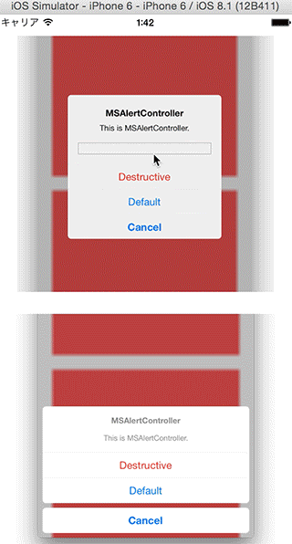
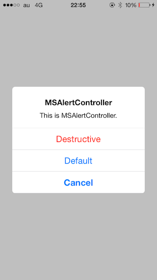
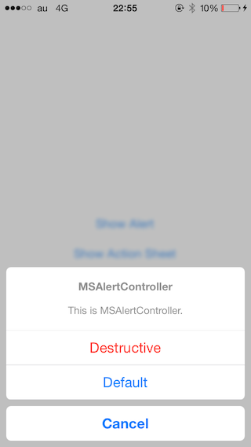
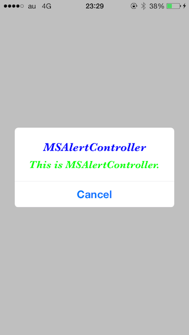
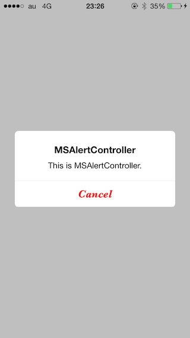
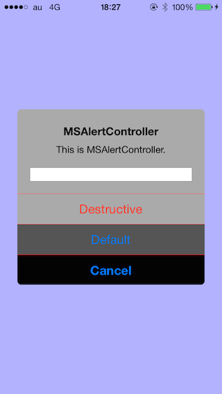

# MSAlertController

[](http://cocoadocs.org/docsets/MSAlertController)
[](http://cocoadocs.org/docsets/MSAlertController)
[](http://cocoadocs.org/docsets/MSAlertController)

## You can use AlertController in iOS7!!
#### MSAlertController has same feature at UIAlertViewController.
- Alert
- ActionSheet

#### In addtion, customize font, font size and font color.



## Usage
To run the example project, clone the repo, and run `pod install` from the Example directory first.


#### For Alert



Set ```MSAlertControllerStyleAlert``` to preferredStyle.


``` objective-c

	MSAlertController *alertController = [MSAlertController alertControllerWithTitle:@"MSAlertController" message:@"This is MSAlertController." preferredStyle:MSAlertControllerStyleAlert];
    
    MSAlertAction *action = [MSAlertAction actionWithTitle:@"Cancel" style:MSAlertActionStyleCancel handler:^(MSAlertAction *action) {
        //Write a code for this action.
    }];
    [alertController addAction:action];
    
    MSAlertAction *action2 = [MSAlertAction actionWithTitle:@"Destructive" style:MSAlertActionStyleDestructive handler:^(MSAlertAction *action) {
        //Write a code for this action.
    }];
    [alertController addAction:action2];
    
    MSAlertAction *action3 = [MSAlertAction actionWithTitle:@"Default" style:MSAlertActionStyleDefault handler:^(MSAlertAction *action) {
        //Write a code for this action.
    }];
    [alertController addAction:action3];
    
    [self presentViewController:alertController animated:YES completion:nil];
	
```


#### For Action Sheet



Set ```MSAlertControllerStyleActionSheet``` to preferredStyle.


``` objective-c

	MSAlertController *alertController = [MSAlertController alertControllerWithTitle:@"MSAlertController" message:@"This is MSAlertController." preferredStyle:MSAlertControllerStyleActionSheet];
    
    MSAlertAction *action = [MSAlertAction actionWithTitle:@"Cancel" style:MSAlertActionStyleCancel handler:^(MSAlertAction *action) {
        //Write a code for this action.
    }];
    [alertController addAction:action];
    
    MSAlertAction *action2 = [MSAlertAction actionWithTitle:@"Destructive" style:MSAlertActionStyleDestructive handler:^(MSAlertAction *action) {
        //Write a code for this action.
    }];
    [alertController addAction:action2];
    
    MSAlertAction *action3 = [MSAlertAction actionWithTitle:@"Default" style:MSAlertActionStyleDefault handler:^(MSAlertAction *action) {
        //Write a code for this action.
    }];
    [alertController addAction:action3];
    
    [self presentViewController:alertController animated:YES completion:nil];
	
```


## Customization
#### For Action Controller
``` objective-c
@property (strong, nonatomic) UIColor *titleColor;
@property (strong, nonatomic) UIFont *titleFont;
@property (strong, nonatomic) UIColor *messageColor;
@property (strong, nonatomic) UIFont *messageFont;
@property (assign, nonatomic) BOOL enabledBlurEffect;
@property (strong, nonatomic) UIColor *backgroundColor;
@property (assign, nonatomic) CGFloat alpha;
@property (strong, nonatomic) UIColor *alertBackgroundColor;
@property (strong, nonatomic) UIColor *separatorColor;
```



``` objective-c
MSAlertController *alertController = [MSAlertController alertControllerWithTitle:@"MSAlertController" message:@"This is MSAlertController." preferredStyle:MSAlertControllerStyleAlert];
alertController.titleColor = [UIColor blueColor];
alertController.titleFont = [UIFont fontWithName:@"Baskerville-BoldItalic" size:20.0f];
alertController.messageColor = [UIColor greenColor];
alertController.messageFont = [UIFont fontWithName:@"Baskerville-BoldItalic" size:18.0f];
```


#### For Action
``` objective-c
@property (strong, nonatomic) UIColor *titleColor;
@property (strong, nonatomic) UIFont *font;
@property (strong, nonatomic) UIColor *normalColor;
@property (strong, nonatomic) UIColor *highlightedColor;
```



``` objective-c
MSAlertAction *action = [MSAlertAction actionWithTitle:@"Cancel" style:MSAlertActionStyleCancel handler:^(MSAlertAction *action) {
    //Write a code for this action.
}];
action.titleColor = [UIColor redColor];
action.font = [UIFont fontWithName:@"Baskerville-BoldItalic" size:18.0f];
[alertController addAction:action];
```

#### Combination
``` objective-c

    MSAlertController *alertController = [MSAlertController alertControllerWithTitle:@"MSAlertController" message:@"This is MSAlertController." preferredStyle:MSAlertControllerStyleAlert];
    alertController.alertBackgroundColor = [UIColor lightGrayColor];
    alertController.backgroundColor = [UIColor blueColor];
    alertController.alpha = 0.3f;
    alertController.separatorColor = [UIColor redColor];
    
    MSAlertAction *action = [MSAlertAction actionWithTitle:@"Cancel" style:MSAlertActionStyleCancel handler:^(MSAlertAction *action) {
        NSLog(@"Cancel action tapped %@", action);
    }];
    action.normalColor = [UIColor blackColor];
    action.highlightedColor = [UIColor yellowColor];
    [alertController addAction:action];
    
    MSAlertAction *action2 = [MSAlertAction actionWithTitle:@"Destructive" style:MSAlertActionStyleDestructive handler:^(MSAlertAction *action) {
        NSLog(@"Destructive action tapped %@", action);
    }];
    [alertController addAction:action2];

    MSAlertAction *action3 = [MSAlertAction actionWithTitle:@"Default" style:MSAlertActionStyleDefault handler:^(MSAlertAction *action) {
        NSLog(@"Default action tapped %@", action);
    }];
    action3.normalColor = [UIColor darkGrayColor];
    action3.highlightedColor = [UIColor whiteColor];
    [alertController addAction:action3];
    
    [alertController addTextFieldWithConfigurationHandler:nil];
    
    [self presentViewController:alertController animated:YES completion:nil];
```



Action Sheet is compatible with same customization.

## Requirements
- iOS 7.0 and greater
- ARC
- QuartzCore.framework
- Accelerate.framework

## Installation

MSAlertController is available through [CocoaPods](http://cocoapods.org). To install
it, simply add the following line to your Podfile:

    pod "MSAlertController"

## Other

A sample of this project uses "[SACollectionViewVerticalScalingFlowLayout](https://github.com/szk-atmosphere/SACollectionViewVerticalScalingFlowLayout)" to apply scaling effect for scrolling.

## Author

Taiki Suzuki, s1180183@gmail.com

## License

MSAlertController is available under the MIT license. See the LICENSE file for more info.

